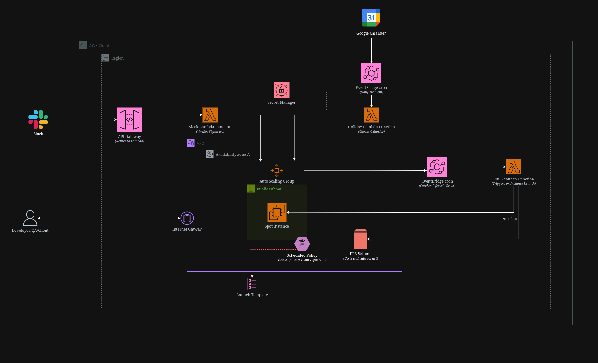

# Staging-on-demand

A cost-optimized, self-healing staging environment on AWS. Runs only during working hours, skips public holidays automatically, and can be started or stopped manually from Slack at any time, no ticket, no waiting.

Costs roughly **$4.55 to $5.25 a month**, compared to about $33 a month for the same instance class running 24/7 on demand.



Three independent triggers, a native AWS schedule, a holiday-aware Lambda, and a Slack command, all update the same Auto Scaling Group. None of them can push the ASG outside whatever min/max is currently set, and none of them fight each other.

---

## What this deploys

- An Auto Scaling Group running spot instances, with a mixed instance type fallback (`t3.medium` → `t3.small` → `t3.micro`)
- A native ASG scheduled action for the routine daily on/off cycle, no Lambda involved
- A Lambda that checks a public holiday calendar and forces the ASG down on days nobody's working
- A Slack integration (`/staging-stop` and `/staging-start`) for anything the schedule can't predict
- A persistent EBS volume that survives every instance replacement, reattached automatically via a lifecycle hook and a dedicated Lambda
- All the supporting IAM roles, security group, Secrets Manager entries, API Gateway, and EventBridge rules needed to wire the above together

## Prerequisites

- An AWS account with an IAM user that has permissions for EC2, Auto Scaling, Lambda, IAM role creation, Secrets Manager, API Gateway, and EventBridge
- A Google Cloud project (for the service account the holiday check uses)
- A Slack workspace where you can install apps
- Terraform 1.5 or newer, with the AWS CLI already configured

## Setup

### 1. Find your VPC and subnet

```bash
aws ec2 describe-vpcs --region ap-south-1 \
  --query 'Vpcs[*].{ID:VpcId,CIDR:CidrBlock,IsDefault:IsDefault}' \
  --output table

aws ec2 describe-subnets --region ap-south-1 \
  --filters "Name=vpc-id,Values=<your-vpc-id>" \
  --query 'Subnets[*].{ID:SubnetId,AZ:AvailabilityZone,CIDR:CidrBlock,Public:MapPublicIpOnLaunch}' \
  --output table
```

Pick a subnet with `Public = true`, since the instance serves HTTP/HTTPS directly. Note its Availability Zone, EBS volumes are locked to a single AZ.

### 2. Confirm IAM permissions on the deploying user

The IAM user running `terraform apply` needs explicit permission to create IAM roles. This isn't implied by EC2 or Lambda access alone. If you hit:

```
AccessDenied: User ... is not authorized to perform: iam:CreateRole
```

attach a policy granting at minimum `iam:CreateRole`, `iam:DeleteRole`, `iam:PutRolePolicy`, `iam:DeleteRolePolicy`, `iam:CreateInstanceProfile`, `iam:AddRoleToInstanceProfile`, `iam:PassRole`, and the related read/list actions.

### 3. Set up the Google service account (for the holiday check)

Google Cloud Console → APIs & Services → Credentials → Create Credentials → Service Account. Choose **Application data**, not User data, since this needs to run unattended. Skip the permissions step entirely, it grants project-level IAM roles the Lambda doesn't need.

Generate a JSON key for the service account (Keys tab → Add Key → Create new key → JSON).

If you only need official public holidays and nothing company-specific, no calendar sharing is needed at all. Google's public "Holidays in Nepal" calendar has ID:

```
en.np#holiday@group.v.calendar.google.com
```

Swap this for the appropriate public holiday calendar if you're deploying for a different country.

### 4. Upload secrets to AWS Secrets Manager

Never paste secret values into a chat tool, a screenshot, or anywhere other than directly into the AWS CLI or console.

```bash
aws secretsmanager create-secret \
  --name staging/google-calendar-creds \
  --secret-string file:///path/to/downloaded-key.json \
  --region ap-south-1

aws secretsmanager create-secret \
  --name staging/slack-signing-secret \
  --secret-string "placeholder-will-replace-later" \
  --region ap-south-1
```

The Slack secret only needs a real value once you've created the Slack app in step 6, a placeholder is fine for now since Terraform only references the secret's name, not its contents.

### 5. Configure and deploy

```bash
cp terraform.tfvars.example terraform.tfvars
# edit terraform.tfvars with your VPC ID, subnet ID, AZ, key pair name, etc.

terraform init
terraform plan
terraform apply
```

### 6. Set up the Slack app

api.slack.com/apps → Create New App → From an app manifest. Use the manifest below, replacing the URL with your `terraform output slack_commands_endpoint`:

```json
{
  "display_information": {
    "name": "Staging Control",
    "description": "Manually stop or start the staging environment"
  },
  "oauth_config": {
    "scopes": { "bot": ["commands"] }
  },
  "features": {
    "bot_user": {
      "display_name": "staging-control",
      "always_online": false
    },
    "slash_commands": [
      {
        "command": "/staging-stop",
        "url": "https://YOUR-API-ID.execute-api.ap-south-1.amazonaws.com/slack/commands",
        "description": "Stop the staging server",
        "should_escape": false
      },
      {
        "command": "/staging-start",
        "url": "https://YOUR-API-ID.execute-api.ap-south-1.amazonaws.com/slack/commands",
        "description": "Start the staging server",
        "should_escape": false
      }
    ]
  },
  "settings": {
    "org_deploy_enabled": false,
    "socket_mode_enabled": false,
    "is_hosted": false,
    "token_rotation_enabled": false
  }
}
```

Install the app to your workspace (Install App → Install to Workspace, this is a separate step from creating the app). Copy the real **Signing Secret** from Basic Information → App Credentials, then update the placeholder:

```bash
aws secretsmanager put-secret-value \
  --secret-id staging/slack-signing-secret \
  --secret-string "the-real-signing-secret" \
  --region ap-south-1
```

Test `/staging-stop` in any channel the app has access to.

## Verifying it works

- **Slack:** type `/staging-stop`, confirm the ASG's desired capacity drops to zero. Type `/staging-start`, confirm the instance comes up within a minute or two.
- **Holiday check:** add a test event to the calendar for today, manually invoke the Lambda, confirm the ASG gets forced to zero. Remove the test event, confirm a second invocation does nothing.
- **Daily schedule:** check the ASG's activity history around the two scheduled times, one scale up in the morning, one scale down in the evening, no Lambda involved.
- **EBS reattachment:** terminate the running instance manually. Once the replacement comes up, confirm the same EBS volume ID is attached to it, and that data from before the termination survived.

## Known gotchas

- **Lambda source files must sit inside `lambda/`**, matching the `source_file` path each `archive_file` data source expects. A misplaced file fails with `could not archive missing file`.
- **AWS resource descriptions only accept ASCII.** An em dash or other non-ASCII character in a security group description will fail with `Character sets beyond ASCII are not supported`.
- **Slack's manifest schema rejects an empty `usage_hint` field.** Remove it entirely rather than leaving it blank.
- **Slash commands require a declared `commands` bot scope and a `bot_user` block**, even though this integration never sends bot messages, Slack requires the bot identity to exist on paper.
- **Never cache rotatable secrets in a Lambda's global scope.** An earlier version of the Slack Lambda cached the signing secret in memory, so updating the secret's value didn't take effect until the Lambda's execution environment recycled, resulting in silent 401s with no error in the logs. Fetch fresh on every invocation instead.
- **Certbot should never run in the boot-time `user_data` script.** Since the instance restarts daily, re-requesting a certificate on every boot will hit Let's Encrypt's rate limit within days. Certificates should live on the persistent EBS volume and only be issued once.

## Cost breakdown

Based on `ap-south-1`, a `t3.medium`-class instance, roughly 35 working hours a week:

| Component | Estimated cost |
|---|---|
| EC2 compute (spot, ~152 hrs/month) | $2.10 – $2.80 |
| EBS volume (20GB gp3) | ~$1.60 |
| Secrets Manager (2 secrets) | ~$0.80 |
| Lambda, API Gateway, EventBridge | ~$0 at this volume |
| CloudWatch Logs | ~$0.05 |
| **Total** | **~$4.55 – $5.25/month** |
